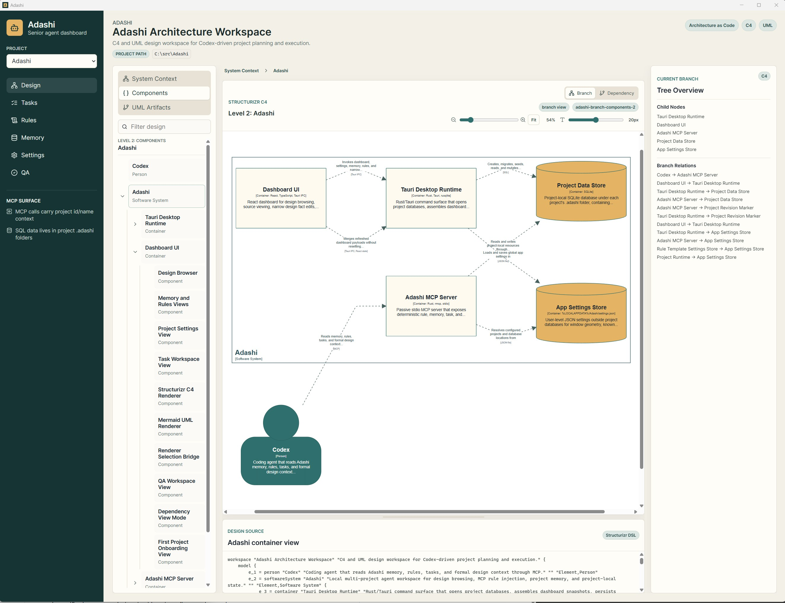
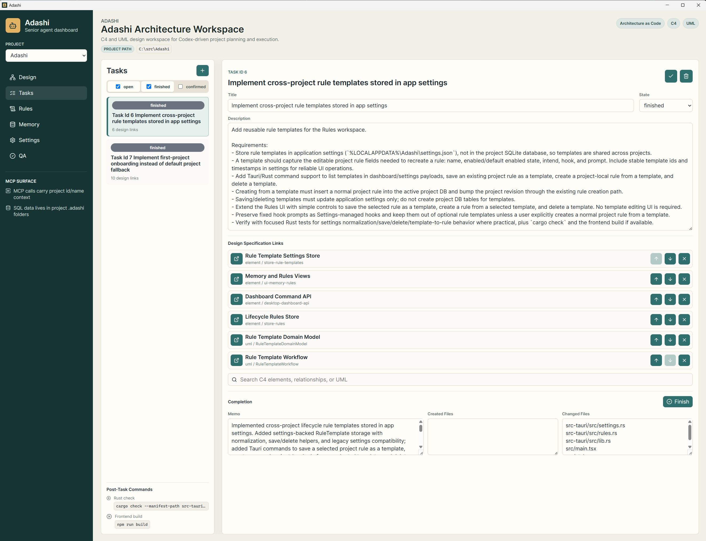
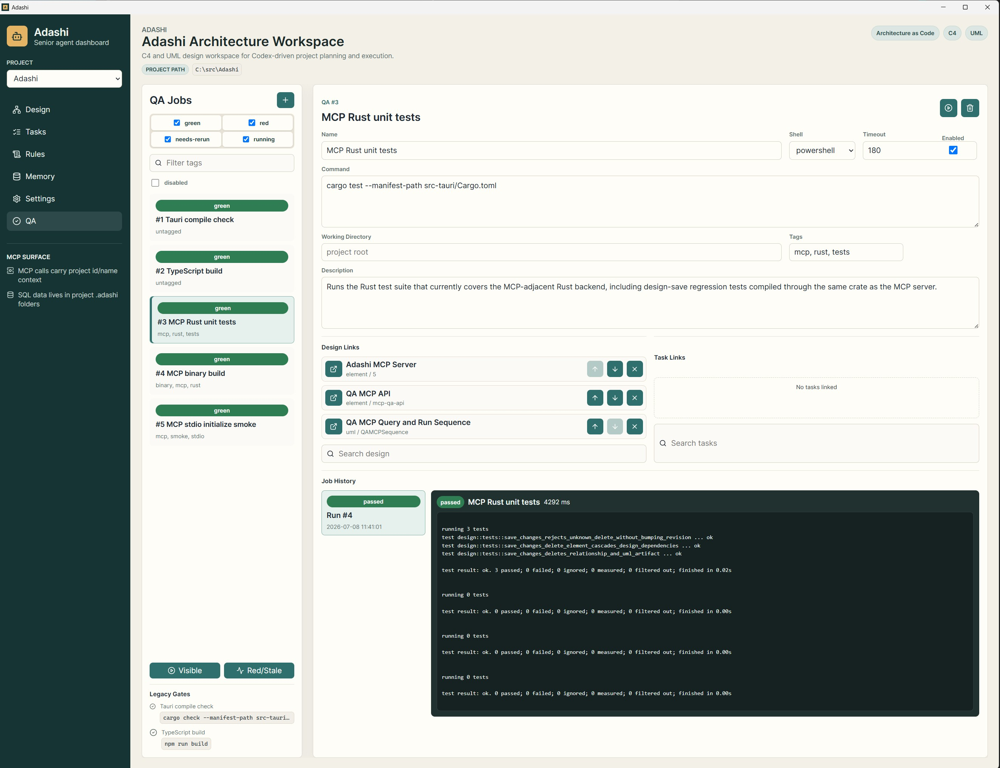

# Adashi

Adashi is a local desktop add-on and dashboard for agentic coding workspaces such as Codex or Claude Code. It connects to the agent as an MCP server and gives that agent durable project memory, explicit lifecycle rules, formal design context, task tracking, and QA evidence without pushing that responsibility into a chat transcript or a remote service.

It is built for the moment when an agent stops being a one-shot autocomplete helper and starts acting like a long-running collaborator on a real project. The coding still happens in the agentic workspace you already use. Adashi sits beside it as the local context, design, task, and verification layer. Small repositories can survive on the current prompt plus a few open files. Large projects need more: architecture that can be queried, decisions that survive across sessions, tasks that stay linked to the parts of the system they change, and verification commands that are repeatable.

Adashi provides that layer.



## Why It Exists

Agentic coding gets weaker when context is informal.

For developers, the failure mode is familiar: the agent forgets prior decisions, changes code against stale architecture, invents missing conventions, or loses the reason a task exists. On large projects this turns into review churn and subtle regressions.

For non-developer "vibe coders", the problem is sharper. You can describe what you want, but it is hard to keep the agent aligned with the actual shape of the app, the existing product decisions, and the verification steps that prove a change worked. The bigger the project gets, the more the agent needs a map instead of vibes alone.

Adashi improves agentic coding by making important project context explicit and available to the agent through MCP:

- Agents can read project memory before starting work.
- Agents can receive rule injections at predictable lifecycle points.
- Agents can query formal C4 and UML design instead of guessing architecture from filenames.
- Tasks can point directly at the design elements they are meant to change.
- QA jobs can be stored, linked, run, and reviewed as evidence.
- Each project keeps its own `.adashi` database, so context travels with the repository.

The goal is not to replace Codex, Claude Code, or any other coding agent. The goal is to give those agents a project-native support system: memory, structure, intent, and feedback.

## Who It Helps

Adashi is useful for experienced developers who want agents such as Codex or Claude Code to respect architecture and project rules across sessions. It is especially helpful when a repository has multiple subsystems, a non-trivial desktop or backend architecture, or recurring verification commands that should not be rediscovered every day.

It is also useful for non-developers building with AI. Adashi turns "please keep this in mind" into stored project memory, "follow this rule" into lifecycle prompts, and "this feature belongs over there" into linked design and task records the agent can read directly.

## Features

### Multi-Project Local Dashboard

Adashi is a Tauri desktop dashboard that manages context for multiple local projects. App-level settings live in the user's local application data, while each project gets its own `.adashi/adashi.sqlite3` database inside the project folder.

This keeps project memory, tasks, rules, design, and QA evidence local to the repository instead of scattering it across chat history.

### First-Project Onboarding

When no usable project is configured, Adashi shows a blocking onboarding flow instead of silently inventing a fake default project. You can create or select the first project folder, and Adashi initializes the local project store before opening the dashboard.

### Project Memory

Each project has editable long-term memory and a memory protocol. Agents can read this memory through MCP before starting work, so stable project knowledge does not need to be repeated in every prompt.

Typical memory entries include:

- Architectural decisions
- Recent implementation notes
- Known tool quirks
- Verification commands
- Project-specific boundaries and preferences

### Lifecycle Rule Injection

Adashi exposes lifecycle hooks for agent runs:

- `run.start`
- `task.start`
- `task.end`
- `run.end`

Rules are scoped by intent:

- `general`
- `design`
- `implementation`

This lets a project inject the right guidance at the right time. For example, an implementation run can receive coding standards and relevant design context before changes begin, while a design run can receive authoring guidance without implying code edits.

### Formal Design Workspace

Adashi stores a formal design model alongside the project. The design workspace supports C4-style structure and typed UML artifacts:

- Structure diagrams for static shape and contracts
- Sequence diagrams for interactions
- Flow diagrams for workflows
- State diagrams for lifecycle behavior

The desktop UI includes a design browser with hierarchy navigation, branch views, dependency views, Structurizr rendering, Mermaid rendering, source viewing, zoom controls, and narrow direct edits.

For agents, the important part is determinism: they can query overview, scope, search results, explicit IDs, bindings, and artifacts instead of relying on a vague summary.

### MCP Server For Agents

Adashi includes a local stdio MCP server. It lets compatible coding agents access project context and mutate project state through explicit tools while the agent continues to run in its own workspace.

The MCP surface includes tools for:

- Reading and updating project memory
- Listing, creating, updating, finishing, and deleting tasks
- Reading lifecycle rule injections
- Managing optional project rules
- Reading formal design overview, scopes, search results, IDs, and bindings
- Saving validated design changes
- Listing, creating, updating, deleting, and running QA jobs

MCP calls carry an explicit project id or project name, which matters when one Adashi app manages several repositories.

### Task Workspace

Tasks are project-local records with a deliberately small lifecycle:

- `open`
- `finished`
- `confirmed`

Tasks can link to one or more design specifications, so an agent does not just know "implement settings"; it can know which components, flows, or diagrams define the intended behavior.

Finishing a task can include a lean completion payload with what changed and how it was verified. Confirmation remains a separate human step.

### QA Workspace

Adashi stores reusable QA jobs with commands, working directories, tags, enabled state, timeout settings, design links, and task links.

QA runs create immutable evidence, so the project can answer "what did we run, when, and what happened?" without scraping terminal history.

This is designed to stay lightweight: v1 favors ad hoc query-driven runs over heavyweight batch management.

### Rule Templates

Project-local rules can be saved as reusable templates in app settings. This makes it easy to reuse common lifecycle guidance across projects while keeping each project's active rules stored in that project's own database.

### Settings And Project State

Adashi separates user-level and project-level state:

- User settings: known projects, active project, window geometry, and reusable rule templates
- Project state: memory, rules, design workspace, tasks, QA jobs, run evidence, and revision marker

This separation lets one local app manage many repositories while keeping repository-specific context near the repository.

## More Screenshots

Tasks can be linked directly to design specifications, so implementation work keeps a visible connection to the architecture it is meant to change.



QA jobs keep verification commands, design links, task links, and run evidence in the project instead of leaving them buried in terminal history.



## Tech Stack

- Desktop shell: Tauri 2
- Frontend: React 18, TypeScript, Vite
- UI helpers: lucide-react, EasyMDE
- Diagrams: Structurizr viewer assets, Mermaid
- Backend: Rust
- Local database: SQLite through `rusqlite` with bundled SQLite
- Agent integration: MCP over stdio through `rmcp`
- Serialization and schemas: Serde, Serde JSON, Schemars

## Installation

### Prerequisites

Install the normal Tauri 2 development prerequisites for your operating system:

- Node.js and npm
- Rust and Cargo
- Platform WebView/build tooling required by Tauri

On Windows, this generally means Rust, Microsoft build tools, and WebView2.

### Run From Source

Clone the repository and install JavaScript dependencies:

```powershell
npm install
```

Run the desktop app in development mode:

```powershell
npm run tauri dev
```

Create a production build:

```powershell
npm run tauri build
```

Build only the Rust side:

```powershell
cargo build --manifest-path src-tauri/Cargo.toml
```

Run Rust tests:

```powershell
cargo test --manifest-path src-tauri/Cargo.toml
```

Build the frontend:

```powershell
npm run build
```

### Configure The MCP Server

Build the release binary first:

```powershell
npm run tauri build
```

Then configure your MCP-compatible agent to launch the Adashi MCP server over stdio. For Codex-style TOML configuration, use a stanza like this and adjust the path to your checkout:

```toml
[mcp_servers.adashi]
command = "C:\\src\\Adashi\\src-tauri\\target\\release\\adashi-mcp.exe"
args = []
```

When the MCP server is available, agents should call `adashi_get_rule_injections` at lifecycle hooks and pass the relevant `projectId` for the project they are working on.

## Current Status

Adashi is early software. The core local workflow is in place: desktop UI, project-local stores, formal design browsing, lifecycle rules, memory, tasks, QA jobs, and MCP access. Expect rapid iteration while the agent workflow is refined against real projects.
