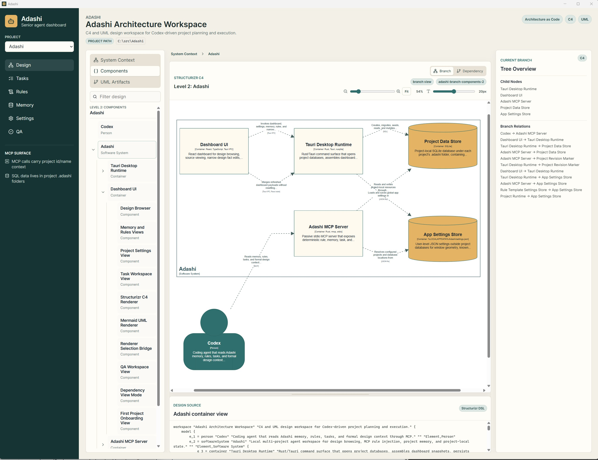
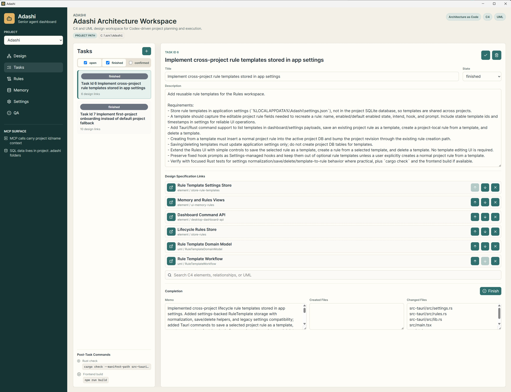
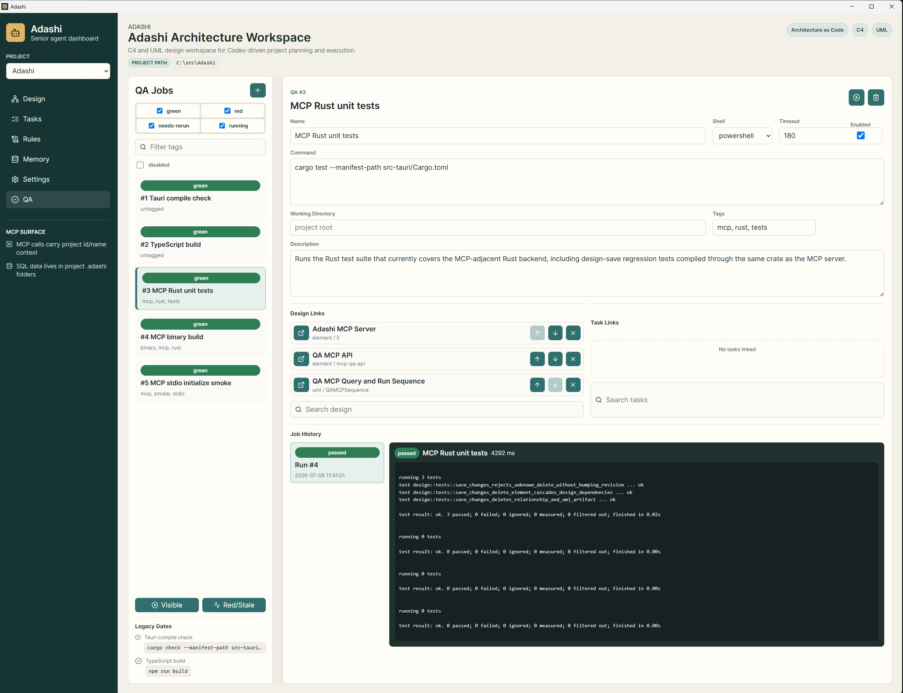

# Adashi

Adashi is a local desktop add-on and dashboard for agentic coding workspaces such as Codex or Claude Code. It connects to the agent as an MCP server and gives that agent durable project memory, explicit lifecycle rules, formal design context, task tracking, and QA evidence without pushing that responsibility into a chat transcript or a remote service.

It is built for the moment when an agent stops being a one-shot autocomplete helper and starts acting like a long-running collaborator on a real project. The coding still happens in the agentic workspace you already use. Adashi sits beside it as the local context, design, task, and verification layer. Small repositories can survive on the current prompt plus a few open files. Large projects need more: architecture that can be queried, decisions that survive across sessions, tasks that stay linked to the parts of the system they change, and verification commands that are repeatable.

Adashi provides that layer.



## Why It Exists

Agentic coding gets weaker when context is informal.

For developers, the failure mode is familiar: the agent forgets prior decisions, changes code against stale architecture, invents missing conventions, or loses the reason a task exists. On large projects this turns into review churn and subtle regressions.

For non-developer "vibe coders", the problem is sharper. You can describe what you want, but it is hard to keep the agent aligned with the actual shape of the app, the existing product decisions, and the verification steps that prove a change worked. The bigger the project gets, the more the agent needs a map instead of vibes alone.

Adashi improves agentic coding by making important project context explicit and available to the agent through MCP:

- Agents can read project memory before starting work.
- Agents can receive rule injections at predictable lifecycle points.
- Agents can query formal C4 and UML design instead of guessing architecture from filenames.
- Tasks can point directly at the design elements they are meant to change.
- QA jobs can be stored, linked, run, and reviewed as evidence.
- Each project keeps its own `.adashi` database, so context travels with the repository.

The goal is not to replace Codex, Claude Code, or any other coding agent. The goal is to give those agents a project-native support system: memory, structure, intent, and feedback.

## Who It Helps

Adashi is useful for experienced developers who want agents such as Codex or Claude Code to respect architecture and project rules across sessions. It is especially helpful when a repository has multiple subsystems, a non-trivial desktop or backend architecture, or recurring verification commands that should not be rediscovered every day.

It is also useful for non-developers building with AI. Adashi turns "please keep this in mind" into stored project memory, "follow this rule" into lifecycle prompts, and "this feature belongs over there" into linked design and task records the agent can read directly.

## Features

### Multi-Project Local Dashboard

Adashi is a Tauri desktop dashboard that manages context for multiple local projects. App-level settings live in the user's local application data, while each project gets its own `.adashi/adashi.sqlite3` database inside the project folder.

This keeps project memory, tasks, rules, design, and QA evidence local to the repository instead of scattering it across chat history.

Project folders are stored per computer in the project database. The key is an
Adashi-specific SHA-256 hash of Windows `MachineGuid`, Linux `machine-id`, or macOS
`IOPlatformUUID`; host-name changes do not change it. Register the local checkout
in app settings on each computer. Opening it records or updates only that
computer's folder, leaving other computers' folders and the shared project identity
alone. The old single `projects.repository_path` is retained as legacy data but is
no longer written or used.

After the one-time schema upgrade and registration of a computer's folder, opening,
refreshing, polling, or browsing the project leaves the database bytes and modification
time unchanged. Migrations run only when the schema version changes, and viewing
mockup previews no longer saves rendered PNGs into the database. Actual edits,
folder changes, and necessary legacy prompt/memory repairs still write their changes.

Desktop and MCP now resolve project storage through the same shared Rust core.
Projects without `.adashi/storage.json` continue using their existing SQLite file.
An optional descriptor can explicitly select SQLite:

```json
{"schemaVersion": 1, "backend": {"kind": "sqlite"}}
```

Git-friendly text and shared server SQL selections are reserved for subsequent
roadmap tasks; this build reports them as unavailable without opening a fallback
database. See the [project storage contract and migration roadmap](docs/project-storage.md).
Reading application settings also leaves their bytes unchanged. Invalid settings
produce an error without replacing the user's registered projects.

### First-Project Onboarding

When no usable project is configured, Adashi shows a blocking onboarding flow instead of silently inventing a fake default project. You can create or select the first project folder, and Adashi initializes the local project store before opening the dashboard.

### Project Memory

Project memory is a short handover aid. Writing a note is optional: save only important decisions, non-obvious constraints, or unresolved blockers with a concrete next step. Skip routine task reports, successful checks, repeated facts, and tool-availability confirmations. Tasks, formal design, and QA hold their own detail.

The dashboard shows the shared summary and active handovers. `run.start` supplies only the current summary, within a separate 2,000-character budget, and the full memory protocol. It never injects the handover log. `memoryContext: "protocolOnly"` skips the summary for operational requests; general requests that need prior decisions can still retrieve memory. `adashi_memory` (operation `get`) supports explicit `query`, `runId`, and `taskId` filters. New notes are limited to 1,000 characters and the editable shared summary to 4,000 characters. Adashi retains at most 20 notes and 12,000 characters across summary and notes, deleting oldest notes first. Oversized new writes are rejected.

Opening memory migrates exact old built-in protocols; custom protocols remain unchanged. Oversized legacy bodies become excerpts ending at complete sentence or paragraph boundaries, with an explicit omission notice. This is not semantic summarization and cannot recover text clipped by previous versions. Oldest notes are then removed until retention limits are met. Maintenance is transactional and updates affected versions and the project revision. An authorized coordinator can replace the summary and resolve explicitly reviewed `supersededNoteIds` atomically under `expectedVersion`. Resolved notes retain their original provenance within normal retention and are available with `includeSuperseded: true`; they are excluded from active memory. Concurrently appended notes remain active. Replay receipts never restore stale bodies.

See [the compact MCP contract and migration guide](docs/context-efficiency.md) for lifecycle section caching, bounded task pages, compatibility, and measured before/after results.

### Architecture Projection

Markdown is an official design artefact alongside C4, UML and mockups. Open **Design →
Documents** to create, format, preview and edit a standalone specification or associate it
with architecture. Task and QA references open the same document; a title rename preserves
its identity. Conflicts retain your draft for explicit reload or reconciliation.

Agents author design prose through MCP. Opted-in projections include complete Markdown
under `docs/adashi`, a document index, and the current shared `agent-workflow.md`; generated
root/folder shorts link to the documents. These files are read-only discovery output.
Configure their directory, inspect output status, or retry generation in Settings.
The [agent workflow](agents_template.md) is deliberately short: it carries the lifecycle
contract and write discipline and indexes the on-demand skills (`design-authoring`,
`markdown-documents`, `task-workflow`, `qa-jobs`, `retrieval`, `memory`, `write-recovery`).
An agent reads one skill through `adashi_help` only when the work matches it, so the full
manual is never always-on. Opted-in projections also mirror the skills under
`docs/adashi/skills`.
Use [controlled Markdown adoption](docs/markdown-adoption.md) to preview existing files,
import through the same editor and convert selected task/QA references without deleting originals.
See the [Markdown implementation and validation report](docs/markdown-validation.md) for
storage, MCP, native desktop and Git acceptance coverage and execution limits.

Adashi keeps the formal design database as the single source of truth, and can additionally project it into the project tree so coding agents read the architecture where they already work. When enabled for a project, Adashi generates a bounded block into the instruction file of the project root and of every folder that contains design-bound files. The block carries the responsibilities and boundaries of the elements that own code there — the information that stops an agent inventing a parallel mechanism that already exists.

Projections are marked as generated, wrapped in `adashi:architecture` markers, and overwritten on regeneration, so the design is edited in Adashi and never in the file. The instruction-file name is configurable in settings and defaults to `AGENTS.md`. Generation is opt-in per project, and disabling it removes every block Adashi wrote. See [the architecture projection contract](docs/architecture-projection.md).

### Lifecycle Rule Injection

Adashi exposes lifecycle hooks for agent runs:

- `run.start`
- `task.start`
- `task.end`
- `run.end`

Rules are scoped by intent:

- `general`
- `design`
- `implementation`

This lets a project inject the right guidance at the right time. For example, an implementation run can receive coding standards and relevant design context before changes begin, while a design run can receive authoring guidance without implying code edits.

### Formal Design Workspace

Adashi stores a formal design model alongside the project. The design workspace supports C4-style structure and typed UML artifacts:

- Structure diagrams for static shape and contracts
- Sequence diagrams for interactions
- Flow diagrams for workflows
- State diagrams for lifecycle behavior

The desktop UI includes a design browser with hierarchy navigation, branch views, dependency views, Structurizr rendering, Mermaid rendering, source viewing, zoom controls, and narrow direct edits.

For agents, the important part is determinism: they can query overview, scope, search results, explicit IDs, bindings, and artifacts instead of relying on a vague summary.

### MCP Server For Agents

Adashi includes a local stdio MCP server. It lets compatible coding agents access project context and mutate project state through explicit tools while the agent continues to run in its own workspace.

The MCP surface includes tools for:

- Searching all project content at once with `adashi_grep` (design, tasks, memory) using grep-shaped output whose locators drill into the owning tool
- Reading and updating project memory
- Listing, creating, updating, finishing, closing, and deleting tasks
- Reading lifecycle rule injections
- Managing optional project rules
- Reading formal design overview, scopes, search results, IDs, and bindings
- Saving validated design changes
- Listing, creating, updating, deleting, and running QA jobs

MCP calls carry an explicit `projectName`, resolved case-insensitively; `projectId` is not accepted, so there is only ever one way to address a project.

### Task Workspace

Tasks are project-local records with a deliberately small lifecycle:

- `todo` — created and unclaimed
- `active` — being worked on
- `finished` — reported complete, awaiting review
- `closed` — reviewed and accepted

`finished` and `closed` are separate on purpose: an agent reporting its own work complete is not a verdict. A review that disagrees with the result sets the task back to `active`, which clears the completion timestamp but keeps the completion memo and file lists as evidence for the next attempt. The task state dropdown in the workspace sets any state directly.

Closed tasks are treated as accepted history: task listings and searches leave them out unless `closed` is requested explicitly, and a listing reports how many it withheld.

Tasks can link to design specifications, so an agent does not just know "implement settings"; it can know which components, flows, or diagrams define the intended behavior. Reading a task returns those links as metadata rather than inlining every linked design branch, which keeps a task read small however many links it carries; retrieve the one or two branches the work needs with the design `get_scope` operation, or ask for all of them with `includeDesignScopes`.

Finishing a task can include a lean completion payload with what changed and how it was verified. Closing remains a separate review step.

### QA Workspace

Adashi stores reusable QA jobs with a declared kind (`lint`, `unit`, `integration`, `e2e`, `smoke`, `build`, `release`), a one-behavior scope, commands, working directories, tags, enabled state, kind-capped timeout settings, design links, and task links. Every runnable job links the design specification or task it verifies, and only a `release` job may package or bundle.

Runs must name their selection, may execute at most twelve jobs inside a wall-clock budget, skip jobs whose evidence is already green unless forced, and reserve each job exclusively. A job whose worker dies is reclaimed as interrupted once its lease expires, and a live run can be cancelled.

QA runs create immutable evidence, so the project can answer "what did we run, when, and what happened?" without scraping terminal history.

This is designed to stay lightweight: v1 favors ad hoc query-driven runs over heavyweight batch management.

### Rule Templates

Project-local rules can be saved as reusable templates in app settings. This makes it easy to reuse common lifecycle guidance across projects while keeping each project's active rules stored in that project's own database.

### Settings And Project State

Adashi separates user-level and project-level state:

- User settings: known projects, active project, window geometry, and reusable rule templates
- Project state: memory, rules, design workspace, tasks, QA jobs, run evidence, and revision marker

This separation lets one local app manage many repositories while keeping repository-specific context near the repository.

## More Screenshots

Tasks can be linked directly to design specifications, so implementation work keeps a visible connection to the architecture it is meant to change.



QA jobs keep verification commands, design links, task links, and run evidence in the project instead of leaving them buried in terminal history.



## Tech Stack

- Desktop shell: Tauri 2
- Frontend: React 18, TypeScript, Vite
- UI helpers: lucide-react, EasyMDE
- Diagrams: Structurizr viewer assets, Mermaid
- Backend: Rust
- Local database: SQLite through `rusqlite` with bundled SQLite
- Agent integration: MCP over stdio through `rmcp`
- Serialization and schemas: Serde, Serde JSON, Schemars

## Installation

### Prerequisites

Install the normal Tauri 2 development prerequisites for your operating system:

- Node.js and npm
- Rust and Cargo
- Platform WebView/build tooling required by Tauri

On Windows, this generally means Rust, Microsoft build tools, and WebView2.

### Run From Source

Clone the repository and install JavaScript dependencies:

```powershell
npm install
```

Run the desktop app in development mode:

```powershell
npm run tauri dev
```

Create a production build:

```powershell
npm run tauri build
```

Build only the Rust side:

```powershell
cargo build --manifest-path src-tauri/Cargo.toml
```

Run Rust tests:

```powershell
cargo test --manifest-path src-tauri/Cargo.toml
```

Build the frontend:

```powershell
npm run build
```

### Linux ARM64 / DGX Spark

Adashi supports Linux ARM64 through a Linux-only Tauri configuration. The Windows configuration, icon, build command, and PowerShell defaults remain unchanged.

On Ubuntu 24.04, install the Tauri and Rust build prerequisites:

```bash
sudo apt-get update
sudo apt-get install -y \
  build-essential curl file libayatana-appindicator3-dev libdbus-1-dev \
  libgtk-3-dev librsvg2-dev libssl-dev libwebkit2gtk-4.1-dev \
  libxdo-dev pkg-config wget
```

Install Rust with rustup when `cargo` is not already available:

```bash
curl --proto '=https' --tlsv1.2 -sSf https://sh.rustup.rs | sh
source "$HOME/.cargo/env"
```

Then install the JavaScript dependencies once:

```bash
npm ci
```

The application version has one source of truth: the top-level `version` field in `package.json`. Tauri reads that value for both the Windows installer and Linux package. Change it with:

```bash
npm version 0.1.2 --no-git-tag-version
```

Replace `0.1.2` with the new release version and commit both `package.json` and the automatically updated `package-lock.json`. Do not set a separate version in a Tauri platform configuration.

Use these Linux commands:

```bash
npm run linux:dev
npm run linux:build
npm run linux:install
npm run linux:build -- mcp
npm run linux:build -- frontend
```

`npm run linux:build` creates the desktop binary and Debian package. `npm run linux:install` performs a fresh desktop build and then installs or reinstalls that exact package. The installer stages the package in an APT-readable temporary location, so private home/build-directory permissions do not produce the `_apt` warning. It uses `sudo` and may prompt for your password.

All generated Linux files stay under `build/linux/`:

- Frontend assets: `build/linux/frontend/`
- Rust binaries: `build/linux/cargo-target/release/`
- Debian package: `build/linux/cargo-target/release/bundle/deb/`

The Linux MCP binary can be configured independently of the Windows executable:

```toml
[mcp_servers.adashi]
command = "/absolute/path/to/Adashi/build/linux/cargo-target/release/adashi-mcp"
args = []
```

Linux user settings are stored in `$XDG_CONFIG_HOME/adashi/settings.json`, or in `$HOME/.config/adashi/settings.json` when `XDG_CONFIG_HOME` is unset. Project databases remain in each project's `.adashi/` directory on both operating systems.

The existing Windows commands below continue to use `dist/`, `src-tauri/target/`, `src-tauri/icons/icon.ico`, and PowerShell defaults. Windows and Linux package filenames both use the version from `package.json`.

### Configure The MCP Server

Build the release binary first:

```powershell
npm run tauri build
```

Then configure your MCP-compatible agent to launch the Adashi MCP server over stdio. For Codex-style TOML configuration, use a stanza like this and adjust the path to your checkout:

```toml
[mcp_servers.adashi]
command = "C:\\src\\Adashi\\src-tauri\\target\\release\\adashi-mcp.exe"
args = []
```

When the MCP server is available, agents should call `adashi_rules` (operation `get_rule_injections`) at lifecycle hooks and pass the relevant `projectName` for the project they are working on. Project names are unique case-insensitively and are resolved case-insensitively; `projectId` is not accepted.

### Agent Instruction Files And Skills

A coding agent only sees what its host reads at startup. Give it a short pointer, not the manual.

Adashi's shared instructions exist in two layers:

- **Always-on workflow.** The short workflow that carries intent classification, the lifecycle hook calls and the write discipline, and that indexes the skills. Adashi publishes it into the project as `docs/adashi/agent-workflow.md`. In this repository the editable source is [agents_template.md](agents_template.md).
- **On-demand skills.** `design-authoring`, `markdown-documents`, `task-workflow`, `qa-jobs`, `retrieval`, `memory` and `write-recovery`. They are compiled into the MCP server and read with `adashi_help` (`skill`), never loaded by default.

**Recommended setup.** Enable the architecture/Markdown projection for the project. Adashi then writes the always-on workflow to `docs/adashi/agent-workflow.md`, mirrors the skills to `docs/adashi/skills/` with an `index.md`, and links both from the `adashi:architecture` block in the project's instruction file. Add a one-line hand-written pointer above that block and leave the block alone:

```markdown
# Project instructions

This project uses Adashi. Read `docs/adashi/agent-workflow.md` before starting work; it carries the
lifecycle hooks and write discipline and indexes the on-demand skills. Read a skill with
`adashi_help` (`skill` = `design-authoring`, `markdown-documents`, `task-workflow`, `qa-jobs`,
`retrieval`, `memory`, `write-recovery`) when the work matches it. If the Adashi MCP server is not
available, the same skills are mirrored under `docs/adashi/skills/`.

Project-specific rules for this repository go here; Adashi preserves everything outside its managed
block. Cross-cutting rules that should arrive at a lifecycle hook belong in Adashi rules instead.

<!-- adashi:architecture:begin -->
<!-- Generated by Adashi from the design model; do not edit. It carries this folder's
     responsibilities, its boundaries, and links to the workflow and skill index. -->
<!-- adashi:architecture:end -->
```

The instruction-file name is configurable and defaults to `AGENTS.md`; use whatever name the agent host actually reads. On case-sensitive filesystems `agents.md` and `AGENTS.md` are different files, so keep one spelling.

**Do not copy the workflow or the skills into the instruction file.** Inlining them makes the whole manual load on every request, and any later Adashi upgrade leaves a stale copy behind. Point at the generated files, or at most keep one hand-maintained source file in the project root and re-copy it deliberately on upgrade. Prefer reading skills through `adashi_help`: an MCP fetch always matches the running server version, while a mirrored file is refreshed only when the project is regenerated.

**How an agent picks a skill.** The always-on workflow lists each skill with the work it covers; the agent reads at most the one that matches. For example, a change that touches formal design reads `design-authoring`, a rejected write reads `write-recovery`, and a plain investigation reads none of them. The `adashi_help` call needs no project and performs no writes, so it works before the project is set up. If the MCP surface is unavailable, read the mirrored `docs/adashi/skills/<name>.md` file instead and continue.

**Keeping it current.** Regenerate the projection after an Adashi upgrade (Settings, or when the project is loaded with projection enabled). Regeneration rewrites `agent-workflow.md` and the skills mirror; external edits there are reported as drift and overwritten, so treat those files as read-only discovery output.

## Current Status

Adashi is early software. The core local workflow is in place: desktop UI, project-local stores, formal design browsing, lifecycle rules, memory, tasks, QA jobs, and MCP access. Expect rapid iteration while the agent workflow is refined against real projects.
